# COMSM0166

COMSM0166 Software Engineering Discipline and Practice is a team-based project unit for the Computer Science Conversion Course (MSc) at the University of Bristol.

A catalogue of the games and reports for this module from 2023 is provided below.  From 2025 the games are playable in-browser, and so the thumbnail links to the game.

# 2025

<table>
  <tr>
    <td> <a href="https://github.com/UoB-COMSM0166/2025-group-1" target="_blank" rel="noopener noreferrer">Group 1 Repo</a></td>
    <td> <a href="https://github.com/UoB-COMSM0166/2025-group-2" target="_blank" rel="noopener noreferrer">Group 2 Repo</a></td>
    <td> <a href="https://github.com/UoB-COMSM0166/2025-group-3" target="_blank" rel="noopener noreferrer">Group 3 Repo</a></td>
    <td> <a href="https://github.com/UoB-COMSM0166/2025-group-4" target="_blank" rel="noopener noreferrer">Group 4 Repo</a></td>
    <td> <a href="https://github.com/UoB-COMSM0166/2025-group-5" target="_blank" rel="noopener noreferrer">Group 5 Repo</a></td>
  </tr>
  <tr>
    <td> <a href="https://github.com/UoB-COMSM0166/2025-group-6" target="_blank" rel="noopener noreferrer">Group 6 Repo</a></td>
    <td> <a href="https://github.com/UoB-COMSM0166/2025-group-7" target="_blank" rel="noopener noreferrer">Group 7 Repo</a></td>
    <td> <a href="https://github.com/UoB-COMSM0166/2025-group-8" target="_blank" rel="noopener noreferrer">Group 8 Repo</a></td>
    <td> <a href="https://github.com/UoB-COMSM0166/2025-group-9" target="_blank" rel="noopener noreferrer">Group 9 Repo</a></td>
    <td> <a href="https://github.com/UoB-COMSM0166/2025-group-10" target="_blank" rel="noopener noreferrer">Group 10 Repo</a></td>
  </tr>
  <tr>
    <td> <a href="https://github.com/UoB-COMSM0166/2025-group-11a" target="_blank" rel="noopener noreferrer">Group 11a Repo</a></td>
    <td> <a href="https://github.com/UoB-COMSM0166/2025-group-11b" target="_blank" rel="noopener noreferrer">Group 11b Repo</a></td>
    <td> <a href="https://github.com/UoB-COMSM0166/2025-group-12" target="_blank" rel="noopener noreferrer">Group 12 Repo</a></td>
    <td> <a href="https://github.com/UoB-COMSM0166/2025-group-13" target="_blank" rel="noopener noreferrer">Group 13 Repo</a></td>
    <td> <a href="https://github.com/UoB-COMSM0166/2025-group-14" target="_blank" rel="noopener noreferrer">Group 14 Repo</a></td>
    <td> <a href="https://github.com/UoB-COMSM0166/2025-group-15" target="_blank" rel="noopener noreferrer">Group 15 Repo</a></td>
  </tr>
  <tr>
    <td> <a href="https://github.com/UoB-COMSM0166/2025-group-16" target="_blank" rel="noopener noreferrer">Group 16 Repo</a></td>
    <td> <a href="https://github.com/UoB-COMSM0166/2025-group-17" target="_blank" rel="noopener noreferrer">Group 17 Repo</a></td>
    <td> <a href="https://github.com/UoB-COMSM0166/2025-group-18" target="_blank" rel="noopener noreferrer">Group 18 Repo</a></td>
    <td> <a href="https://github.com/UoB-COMSM0166/2025-group-19" target="_blank" rel="noopener noreferrer">Group 19 Repo</a></td>
    <td> <a href="https://github.com/UoB-COMSM0166/2025-group-20" target="_blank" rel="noopener noreferrer">Group 20 Repo</a></td>
  </tr>
  <tr>
    <td> <a href="https://github.com/UoB-COMSM0166/2025-group-21" target="_blank" rel="noopener noreferrer">Group 21 Repo</a></td>
    <td> <a href="https://github.com/UoB-COMSM0166/2025-group-22" target="_blank" rel="noopener noreferrer">Group 22 Repo</a></td>
    <td> <a href="https://github.com/UoB-COMSM0166/2025-group-23" target="_blank" rel="noopener noreferrer">Group 23 Repo</a></td>
    <td> <a href="https://github.com/UoB-COMSM0166/2025-group-24" target="_blank" rel="noopener noreferrer">Group 24 Repo</a></td>
    <td> <a href="https://github.com/UoB-COMSM0166/2025-group-25" target="_blank" rel="noopener noreferrer">Group 25 Repo</a></td>
  </tr>
  <tr>
    <td> <a href="https://github.com/UoB-COMSM0166/2025-group-26" target="_blank" rel="noopener noreferrer">Group 26 Repo</a></td>
    <td> <a href="https://github.com/UoB-COMSM0166/2025-group-27" target="_blank" rel="noopener noreferrer">Group 27 Repo</a></td>
    <td> <a href="https://github.com/UoB-COMSM0166/2025-group-28" target="_blank" rel="noopener noreferrer">Group 28 Repo</a></td>
    <td> <a href="https://github.com/UoB-COMSM0166/2025-group-29" target="_blank" rel="noopener noreferrer">Group 29 Repo</a></td>
    <td> <a href="https://github.com/UoB-COMSM0166/2025-group-30" target="_blank" rel="noopener noreferrer">Group 30 Repo</a></td>
  </tr>
</table>

# 2024

<table>
  <tr>
    <td>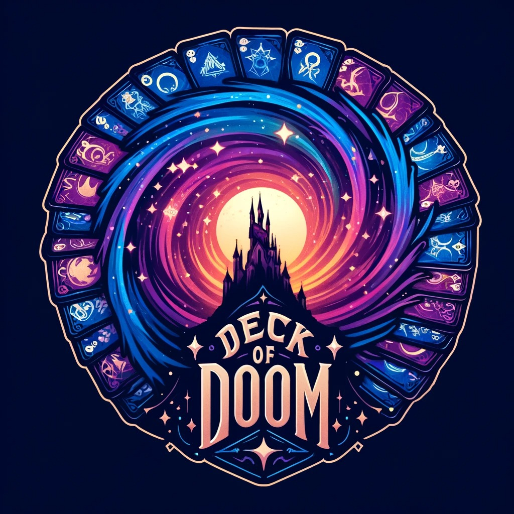 <a href="https://github.com/UoB-COMSM0166/2024-group-1" target="_blank" rel="noopener noreferrer">Group 1 Repo</a></td>
    <td>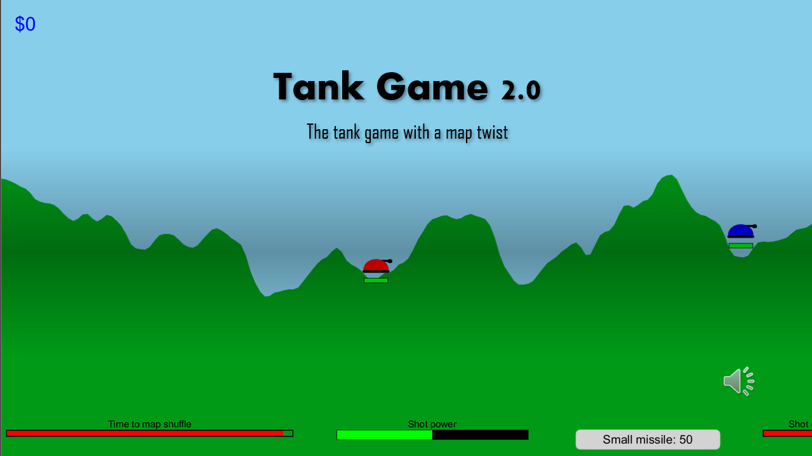 <a href="https://github.com/UoB-COMSM0166/2024-group-2" target="_blank" rel="noopener noreferrer">Group 2 Repo</a></td>
    <td>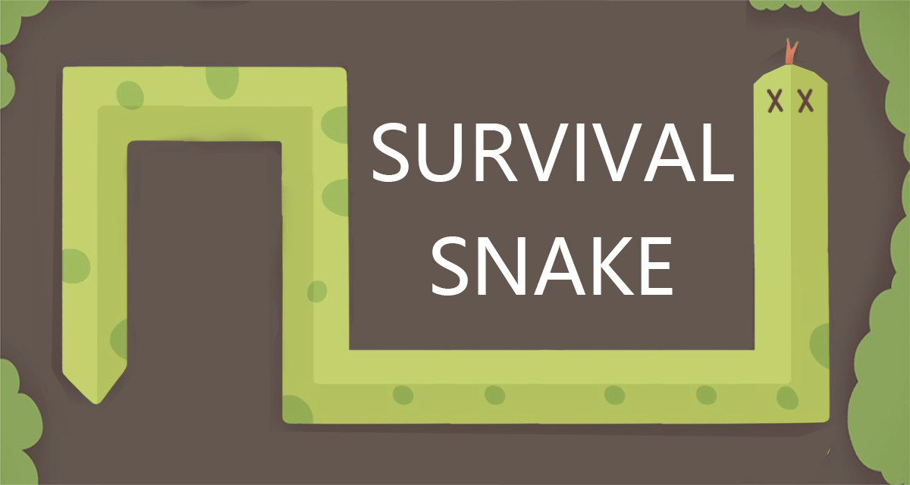 <a href="https://github.com/UoB-COMSM0166/2024-group-3" target="_blank" rel="noopener noreferrer">Group 3 Repo</a></td>
    <td>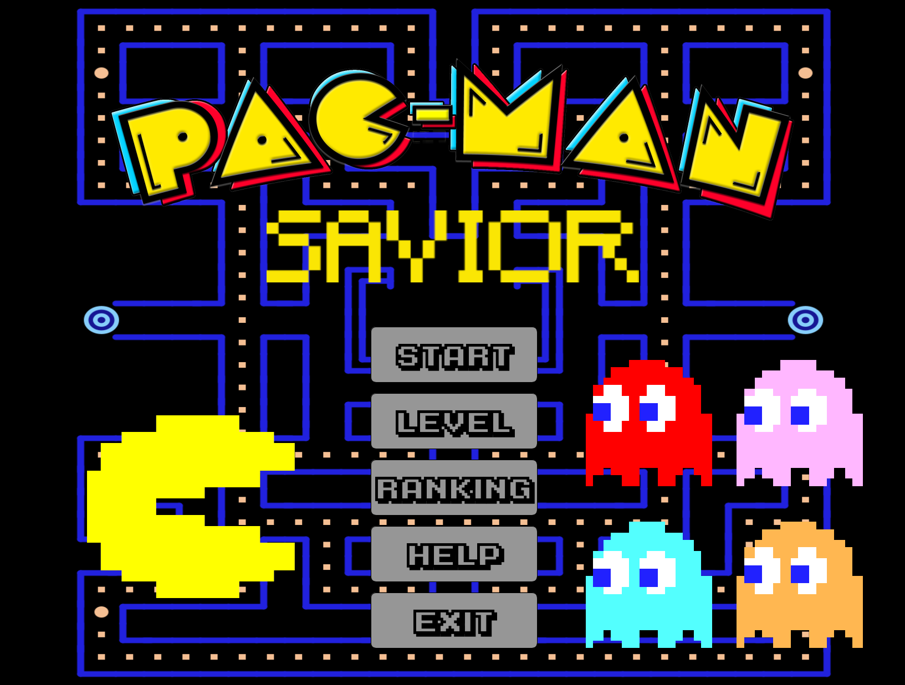 <a href="https://github.com/UoB-COMSM0166/2024-group-4" target="_blank" rel="noopener noreferrer">Group 4 Repo</a></td>
    <td> <a href="https://github.com/UoB-COMSM0166/2024-group-5" target="_blank" rel="noopener noreferrer">Group 5 Repo</a></td>
  </tr>
  <tr>
    <td>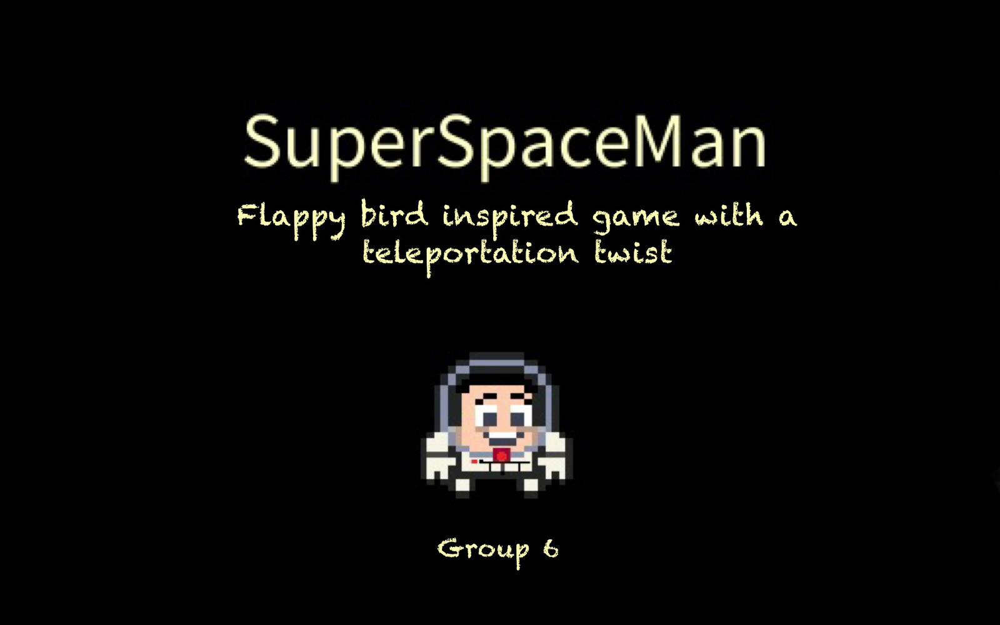 <a href="https://github.com/UoB-COMSM0166/2024-group-6" target="_blank" rel="noopener noreferrer">Group 6 Repo</a></td>
    <td>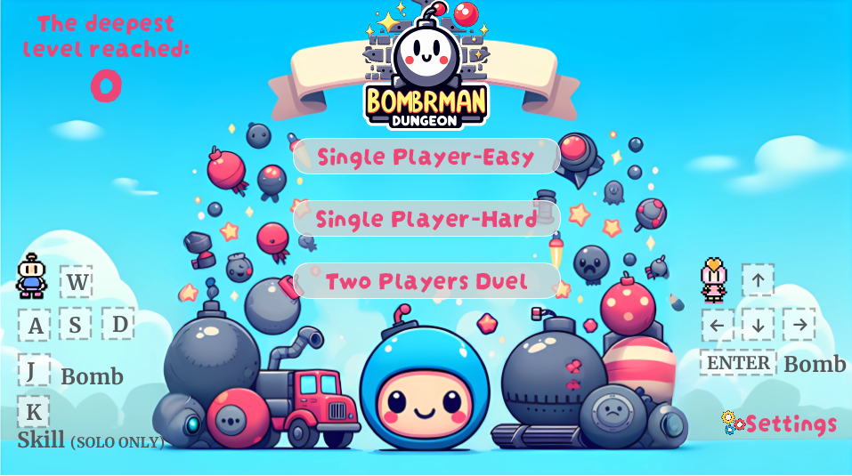 <a href="https://github.com/UoB-COMSM0166/2024-group-7" target="_blank" rel="noopener noreferrer">Group 7 Repo</a></td>
    <td>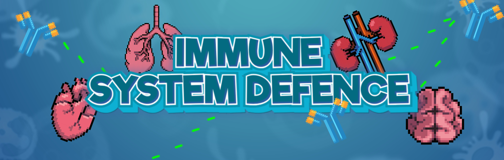 <a href="https://github.com/UoB-COMSM0166/2024-group-8" target="_blank" rel="noopener noreferrer">Group 8 Repo</a></td>
    <td>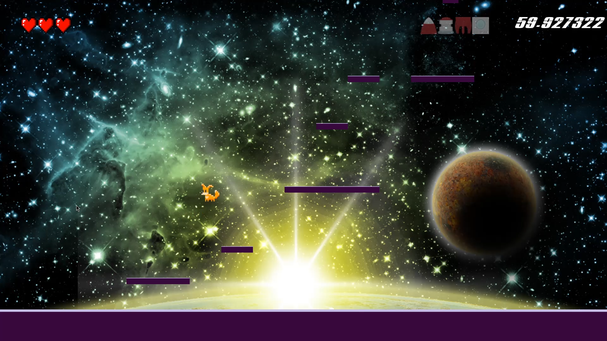 <a href="https://github.com/UoB-COMSM0166/2024-group-9" target="_blank" rel="noopener noreferrer">Group 9 Repo</a></td>
    <td>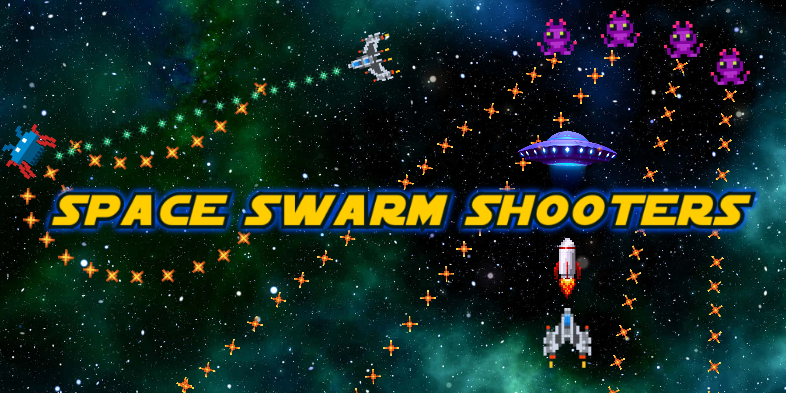 <a href="https://github.com/UoB-COMSM0166/2024-group-10" target="_blank" rel="noopener noreferrer">Group 10 Repo</a></td>
  </tr>
  <tr>
    <td> <a href="https://github.com/UoB-COMSM0166/2024-group-11" target="_blank" rel="noopener noreferrer">Group 11 Repo</a></td>
    <td> <a href="https://github.com/UoB-COMSM0166/2024-group-12" target="_blank" rel="noopener noreferrer">Group 12 Repo</a></td>
    <td> <a href="https://github.com/UoB-COMSM0166/2024-group-13" target="_blank" rel="noopener noreferrer">Group 13 Repo</a></td>
    <td> <a href="https://github.com/UoB-COMSM0166/2024-group-14" target="_blank" rel="noopener noreferrer">Group 14 Repo</a></td>
    <td>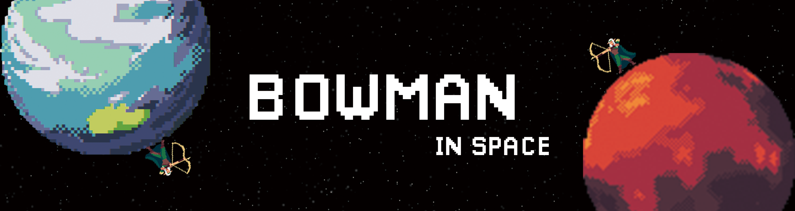 <a href="https://github.com/UoB-COMSM0166/2024-group-15" target="_blank" rel="noopener noreferrer">Group 15 Repo</a></td>
  </tr>
  <tr>
    <td> <a href="https://github.com/UoB-COMSM0166/2024-group-16" target="_blank" rel="noopener noreferrer">Group 16 Repo</a></td>
    <td> <a href="https://github.com/UoB-COMSM0166/2024-group-17" target="_blank" rel="noopener noreferrer">Group 17 Repo</a></td>
    <td> <a href="https://github.com/UoB-COMSM0166/2024-group-18" target="_blank" rel="noopener noreferrer">Group 18 Repo</a></td>
    <td> <a href="https://github.com/UoB-COMSM0166/2024-group-19" target="_blank" rel="noopener noreferrer">Group 19 Repo</a></td>
    <td>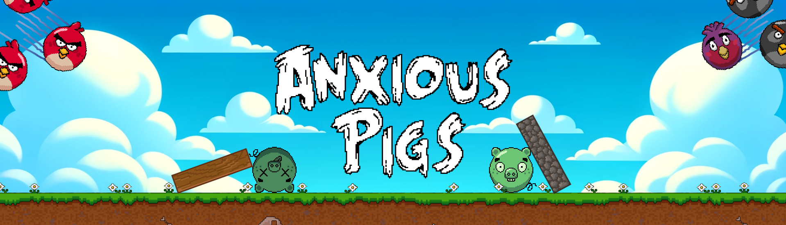 <a href="https://github.com/UoB-COMSM0166/2024-group-20" target="_blank" rel="noopener noreferrer">Group 20 Repo</a></td>
  </tr>
</table>

# 2023
